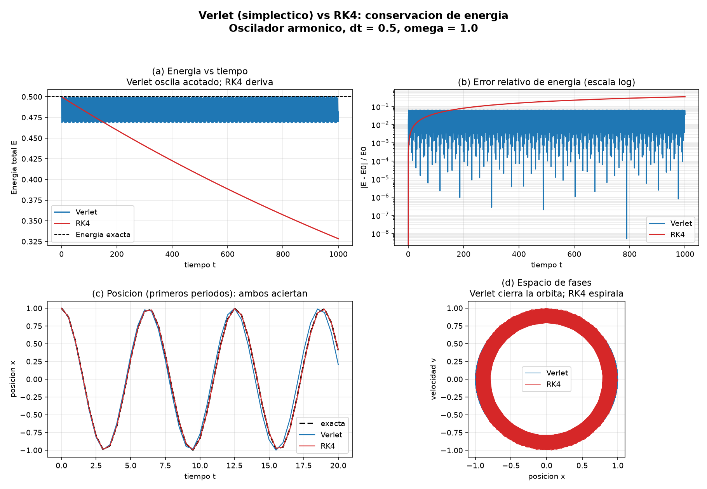

# Verlet vs Runge-Kutta: ¿por qué unos métodos conservan la energía y otros no?

Material didáctico para una clase de grado. Se compara un **integrador
simpléctico** (Verlet de velocidades) con un integrador clásico de alta
precisión (**Runge-Kutta de orden 4, RK4**) usando el oscilador armónico
simple. La conclusión visual: **Verlet mantiene la energía acotada para
siempre; RK4, aunque localmente es más preciso, hace *derivar* la energía de
forma sistemática a tiempos largos.**

## Contenido del repositorio

| Archivo | Qué es |
|---|---|
| `oscilador.py` | Script principal: integradores Verlet y RK4, solución exacta y gráficas. |
| `verificacion.py` | Tests numéricos que comprueban que la implementación es correcta (no requiere matplotlib). |
| `energia_verlet_vs_rk4.png` | Figura resultado (se regenera al correr `oscilador.py`). |

## Cómo correrlo

```bash
pip install numpy matplotlib
python3 oscilador.py        # genera la figura y el resumen numérico
python3 verificacion.py     # corre los chequeos de correctitud
```

`oscilador.py` genera `energia_verlet_vs_rk4.png` y un resumen por consola.



---

## 1. El sistema físico

Oscilador armónico simple (masa con resorte ideal), con `m = k = 1`, de modo
que `ω² = k/m = 1`:

```
d²x/dt² = -ω² x
```

Lo escribimos como un sistema de **primer orden** en la posición `x` y la
velocidad `v` (esto es lo que necesitan los integradores):

```
dx/dt = v
dv/dt = -ω² x
```

La **energía total** (cinética + potencial) es una constante de movimiento:

```
E = ½ m v² + ½ k x²
```

y la solución exacta, contra la que comparamos, es

```
x(t) = x₀ cos(ωt) + (v₀/ω) sin(ωt)
```

---

## 2. Los dos integradores

### Verlet de velocidades (simpléctico)

```
x_{n+1} = x_n + v_n·dt + ½·a_n·dt²
a_{n+1} = -ω²·x_{n+1}
v_{n+1} = v_n + ½·(a_n + a_{n+1})·dt
```

- Es de **segundo orden** (error local `O(dt³)`).
- Sólo necesita **una evaluación de la fuerza por paso** (reusamos `a_{n+1}`).
- Es **reversible en el tiempo** y **simpléctico**.

### Runge-Kutta 4 (no simpléctico)

El RK4 estándar de cuatro etapas `k1…k4`. Es de **cuarto orden** (error local
`O(dt⁵)`): localmente *mucho* más preciso que Verlet. Pero no es simpléctico.

---

## 3. La idea clave: ¿qué es ser "simpléctico"?

La dinámica de un sistema mecánico no es un flujo cualquiera en el espacio de
fases `(x, v)`: es un flujo **simpléctico**, que **preserva el área** (teorema
de Liouville). Un conjunto de condiciones iniciales evoluciona deformándose,
pero el área que ocupa nunca cambia.

- Un **integrador simpléctico** (Verlet) respeta exactamente esa propiedad
  geométrica en cada paso. No conserva la energía *exacta* `E`, pero sí
  conserva de forma casi perfecta una **energía "sombra"** `Ẽ = E + O(dt²)`,
  muy próxima a la real. Por eso el error de energía **oscila acotado** y no
  crece: la órbita en el espacio de fases se mantiene **cerrada**.

- Un **integrador no simpléctico** (RK4) no preserva el área del espacio de
  fases. No existe ninguna energía sombra que conserve, así que el pequeño
  error de cada paso se **acumula en la misma dirección** y la energía
  **deriva** monótonamente. En el oscilador, RK4 es ligeramente disipativo:
  la órbita **espiralea** lentamente hacia el origen.

> **Moraleja:** para integraciones largas (dinámica molecular, mecánica
> celeste, sistemas hamiltonianos en general) lo que importa no es sólo el
> error local por paso, sino **respetar la estructura geométrica** del
> problema. Un método de orden bajo pero simpléctico le gana a uno de orden
> alto pero no simpléctico.

---

## 4. Qué muestran las gráficas

- **(a) Energía vs tiempo:** la banda azul de Verlet se mantiene plana y
  acotada durante 1000 unidades de tiempo; la curva roja de RK4 cae de forma
  suave y sostenida (pierde ~34 % de la energía).
- **(b) Error relativo (escala log):** Verlet oscila dentro de una cota fija;
  RK4 crece monótonamente. Esta es la firma de la deriva.
- **(c) Posición en los primeros períodos:** ambos métodos siguen la solución
  exacta casi perfectamente al principio. El problema **no** se ve a corto
  plazo; sólo aparece **a tiempos largos**.
- **(d) Espacio de fases `(x, v)`:** Verlet recorre una órbita **cerrada**
  (banda anular); RK4 **espiralea hacia adentro**, evidencia directa de que
  está perdiendo energía.

---

## 5. Validación numérica

Para tener confianza en que las gráficas reflejan física real y no un bug,
`verificacion.py` comprueba tres cosas:

| Chequeo | Resultado | Esperado |
|---|---|---|
| Orden de convergencia de Verlet | 2.00 | 2 |
| Orden de convergencia de RK4 | 3.89 → 3.98 | 4 |
| Reversibilidad temporal de Verlet | `|x − x₀| ≈ 2×10⁻¹⁶` | ~0 (precisión de máquina) |
| Energía inicial `E(x₀, v₀)` | 0.5 | 0.5 |

- El **orden de convergencia** se mide viendo cómo cae el error global al
  reducir `dt` a la mitad: para Verlet el error se divide por 4 (orden 2) y
  para RK4 por 16 (orden 4). Esto confirma que **RK4 es localmente mucho más
  preciso** que Verlet... y sin embargo es el que termina derivando.
- La **reversibilidad temporal** (integrar hacia adelante, invertir la
  velocidad y volver exactamente al punto de partida) es una propiedad
  característica de los métodos simplécticos, y aquí se cumple a precisión de
  máquina.

## 6. Para experimentar en clase

- Cambiá `DT`: con pasos más chicos ambos mejoran, pero RK4 **siempre**
  termina derivando si esperás lo suficiente; Verlet **nunca** deriva.
- Aumentá `T_FINAL`: la deriva de RK4 es proporcional al tiempo total.
- Probá `V0 = 0.5` u otras condiciones iniciales: cambia la energía, no el
  comportamiento cualitativo.
- Como ejercicio: implementá **Euler explícito** y mostrá que hace lo
  contrario (la energía *crece* y la espiral se abre hacia afuera).
